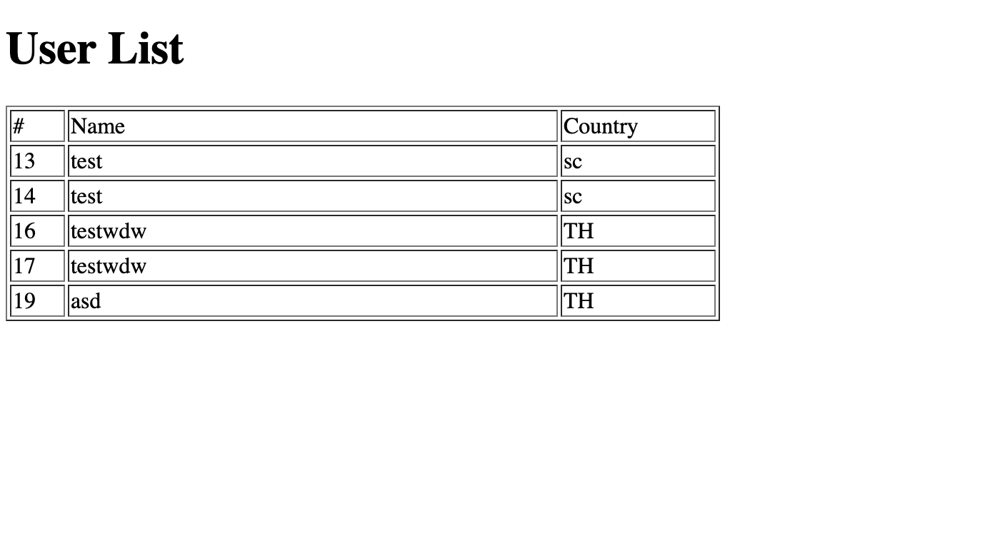
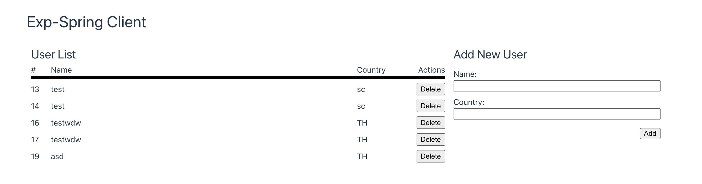

# exp-spring
Experimental Spring with VueJS
## Tech Stacks
* Service-A
  * [Spring Boot Rest](https://spring.io/guides/tutorials/rest/)
  * [JDBC / Postgresql](https://spring.io/projects/spring-data-jdbc)
  * [Spock](https://spockframework.org/)
* Service-B
  * [Spring MVC / Thymeleaf](https://spring.io/guides/gs/serving-web-content/)
  * [OpenFeign](https://github.com/OpenFeign/feign)
* Client
  * [VueJS](https://vuejs.org/)
  * [Axios](https://github.com/axios/axios)
* Dev Environment
  * [Liquibase](https://www.liquibase.org/)
  * [docker & docker compose](https://www.docker.com/)


## Development
---
### Setup Environments
Create and start containers
```bash
docker compose up -d
```

Stop and remove containers, networks and volumns
```bash
docker compose down -v
```

Run database migration
```bash
cd liquibase
liquibase update
```

Install the dependencies for `vue-client`
```bash
cd vue-client
npm install
```

### Run test
```bash
./gradlew test
```

### Compiles, tests and assembles the code into JAR file
```bash
./gradlew build
```

## Run applications
---
### Service A
Start the service A.
```bash
./gradlew :service-a:bootRun
```
The api is available on http://localhost:8081/products

### Service B
Start the service B.
```bash
./gradlew :service-b:bootRun
```
Open a browser to http://localhost:8082.

#### Vue Client
Start the client.
```bash
npm run dev
```
Open a browser to http://localhost:8080.


## Usage
#### [Keycloak Usage](./realm/README.md)
#### [Liquibase Usage](./liquibase/README.md)
#### [Vue-client Usage](./vue-client/README.md)
#### API usage for service A
```bash
export TOKEN=$(curl -X POST "http://localhost:8180/realms/myrealm/protocol/openid-connect/token" \
-d "client_id=spring-app" \
-d "username=myuser" \
-d "password=password" \
-d "grant_type=password" | jq -r '.access_token')

# get all products
curl -v -X GET "http://localhost:8081/product" \
-H "Authorization: Bearer $TOKEN" | jq .

# add product
curl -v -X POST "http://localhost:8081/product" \
      -H "Content-Type:application/json" \
      -H "Authorization: Bearer $TOKEN" \
      -d '{ "name": "rtpk", "price": 100 }' | jq .

# get a product
curl -v -X GET "http://localhost:8081/product/1" \
-H "Authorization: Bearer $TOKEN" | jq .

# delete product
curl -v -X DELETE "http://localhost:8081/product/1" \
-H "Authorization: Bearer $TOKEN" | jq .
```

